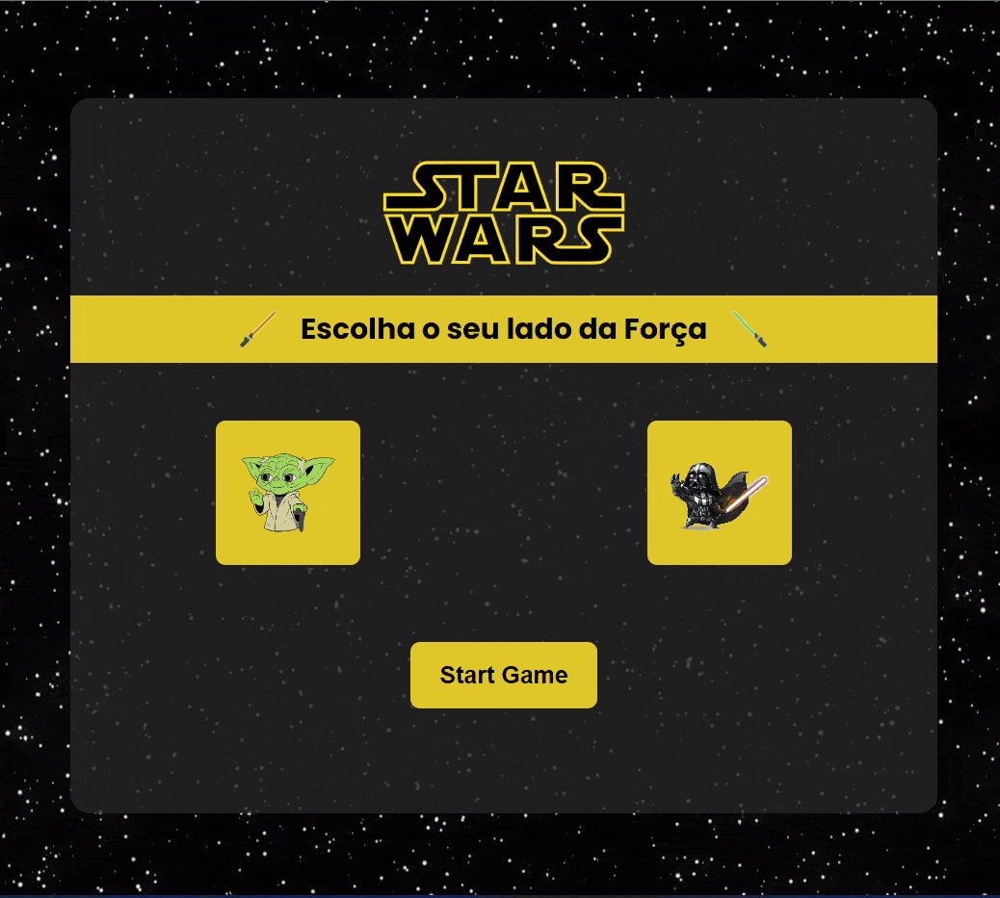

# star-wars-the-game


[//]: 

> O projeto trata-se de um jogo da valha com a tematica de Star Wars. Nele, você poderá escolher o seu personagem favorito e se divertir com os amigos. Esse projeto está sendo desenvolvido com as tecnologia <strong>HTML5</strong>, <strong>CSS3</strong> e <strong>Javascript</strong>.

### Ajustes e melhorias

O projeto ainda está em desenvolvimento e as próximas atualizações serão voltadas nas seguintes tarefas:

- [X] Design
- [ ] Resposividade
- [X] Funcionalidades
- [ ] Correção de bugs


## 💻 Pré-requisitos

Antes de começar, verifique se você atendeu aos seguintes requisitos:

* Navegador `<Google Chrome / Firefox / Microsoft Edge>`


## 🚀 Instalando o Star Wars - The Game

Para instalar o Star Wars - The Game, siga estas etapas:

Linux, macOS e Windows:
```
git clone https://github.com/devCleidison/star-wars-the-game.git
```

ou baixe o arquivo compactado diretamente pelo link:
```
https://github.com/devCleidison/star-wars-the-game/archive/refs/heads/main.zip
```

## ☕ Usando o Star Wars - The Game

Para usar o Star Wars - The Game, siga estas etapas:

```
Abra a pasta do projeto e execute o arquivo index.html dando 2 cliques
```

## 🚀 Quer testar antes?
* [Clique aqui!](https://devcleidison-star-wars-the-game.netlify.app/)

## 📫 Contribuindo para o Star Wars - The Game

Para contribuir com o Star Wars - The Game, siga estas etapas:

1. Bifurque este repositório.
2. Crie um branch: `git checkout -b <nome_branch>`.
3. Faça suas alterações e confirme-as: `git commit -m '<mensagem_commit>'`
4. Envie para o branch original: `git push origin <nome_do_projeto> / <local>`
5. Crie a solicitação de pull.

Como alternativa, consulte a documentação do GitHub em [como criar uma solicitação pull](https://help.github.com/en/github/collaborating-with-issues-and-pull-requests/creating-a-pull-request).


[⬆ Voltar ao topo](#star-wars-the-game)<br>